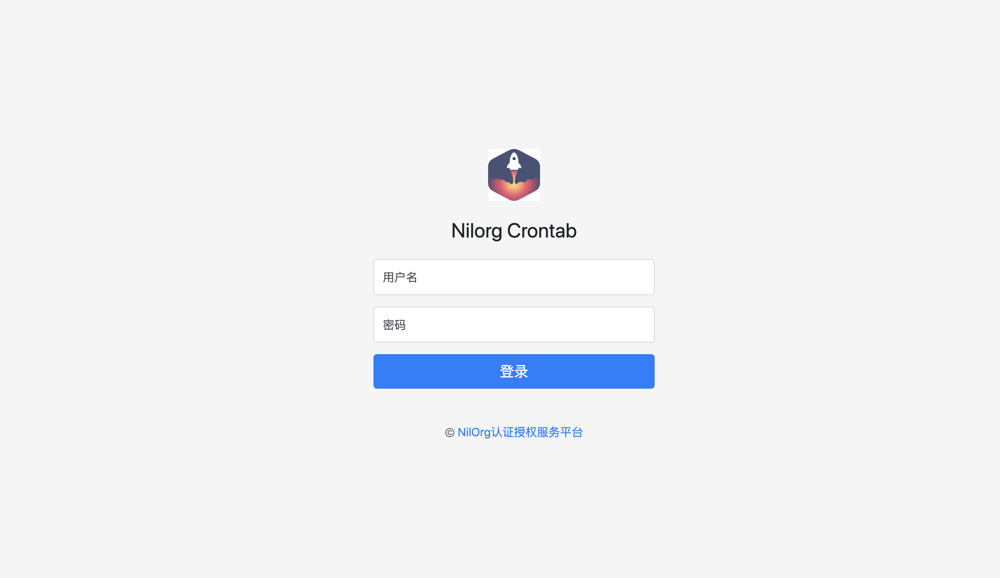

# naas
Authentication authorization server（认证授权服务器）

# 页面展示（以下展示Nilorg任务调度平台对接使用）

1. 登录页面
  
  
2. 授权页面

   


# 功能
✅：以实现&emsp;&emsp;♻️：实现中&emsp;&emsp;❗️：待实现

1. ✅OAuth2
    * ✅授权码模式（Authorization Code）
    * ✅简化模式（Implicit Grant Type）
    * ✅密码模式（Resource Owner Password Credentials Grant）
    * ✅客户端模式（Client Credentials Grant）
    * ✅设备模式（Device Code）
    * ✅内省端点（Token Introspection）
    * ❗️Token销毁端点（Token Revocation）

2. ✅OpenIDConnent
   * ✅jwks
   * ✅openid
   * ✅openid-configuration
   * ✅Userinfo（用户信息端点）
3. ♻️Casbin
   * ♻️RBAC
4. ♻️后台管理系统
   * ✅集成OAuth2认证

# Develop
## Nilorg Gateway

```bash
# client_id=1000
# redirect_uri=http://localhost:8000/auth/callback
http://localhost:8080/oauth2/authorize?client_id=1000&redirect_uri=http://dev.wohuitao.vip:8000/auth/callback&response_type=code&state=somestate&scope=read_write
```

# naas-token-server
在使用AuthorizationCode（授权码模式）进行授权的时候，服务器下发的`code`变量需要开发者单独编写API进行向OAuth2Server获取Token、刷新Token。

使用`naas-token-server`能够帮您减轻不必要的接口开发，帮助您快速构建OAuth2应用API。

客户端读取资源，要保证resource owner、client、token和数据库的记录都匹配才行。

# 关于OAuth应用的范围

范围使您可以准确指定所需的访问类型。范围限制了OAuth令牌的访问。
他们不授予用户已经拥有的权限以外的任何其他权限。

[参考Github OAuth Scopes](https://developer.github.com/apps/building-oauth-apps/understanding-scopes-for-oauth-apps/)

# OpenID Connent

https://contoso.auth0.com/.well-known/openid-configuration

```json
{
    "issuer": "https://contoso.auth0.com/",
    "authorization_endpoint": "https://contoso.auth0.com/authorize",
    "token_endpoint": "https://contoso.auth0.com/oauth/token",
    "userinfo_endpoint": "https://contoso.auth0.com/userinfo",
    "mfa_challenge_endpoint": "https://contoso.auth0.com/mfa/challenge",
    "jwks_uri": "https://contoso.auth0.com/.well-known/jwks.json",
    "registration_endpoint": "https://contoso.auth0.com/oidc/register",
    "revocation_endpoint": "https://contoso.auth0.com/oauth/revoke",
    "scopes_supported": [
        "openid",
        "profile",
        "offline_access",
        "name",
        "given_name",
        "family_name",
        "nickname",
        "email",
        "email_verified",
        "picture",
        "created_at",
        "identities",
        "phone",
        "address"
    ],
    "response_types_supported": [
        "code",
        "token",
        "id_token",
        "code token",
        "code id_token",
        "token id_token",
        "code token id_token"
    ],
    "code_challenge_methods_supported": [
        "S256",
        "plain"
    ],
    "response_modes_supported": [
        "query",
        "fragment",
        "form_post"
    ],
    "subject_types_supported": [
        "public"
    ],
    "id_token_signing_alg_values_supported": [
        "HS256",
        "RS256"
    ],
    "token_endpoint_auth_methods_supported": [
        "client_secret_basic",
        "client_secret_post"
    ],
    "claims_supported": [
        "aud",
        "auth_time",
        "created_at",
        "email",
        "email_verified",
        "exp",
        "family_name",
        "given_name",
        "iat",
        "identities",
        "iss",
        "name",
        "nickname",
        "phone_number",
        "picture",
        "sub"
    ],
    "request_uri_parameter_supported": false,
    "device_authorization_endpoint": "https://contoso.auth0.com/oauth/device/code"
}
```

https://accounts.google.com/.well-known/openid-configuration

```json
{
  "issuer": "https://accounts.google.com",
  "authorization_endpoint": "https://accounts.google.com/o/oauth2/v2/auth",
  "device_authorization_endpoint": "https://oauth2.googleapis.com/device/code",
  "token_endpoint": "https://oauth2.googleapis.com/token",
  "userinfo_endpoint": "https://openidconnect.googleapis.com/v1/userinfo",
  "revocation_endpoint": "https://oauth2.googleapis.com/revoke",
  "jwks_uri": "https://www.googleapis.com/oauth2/v3/certs",
  "response_types_supported": [
    "code",
    "token",
    "id_token",
    "code token",
    "code id_token",
    "token id_token",
    "code token id_token",
    "none"
  ],
  "subject_types_supported": [
    "public"
  ],
  "id_token_signing_alg_values_supported": [
    "RS256"
  ],
  "scopes_supported": [
    "openid",
    "email",
    "profile"
  ],
  "token_endpoint_auth_methods_supported": [
    "client_secret_post",
    "client_secret_basic"
  ],
  "claims_supported": [
    "aud",
    "email",
    "email_verified",
    "exp",
    "family_name",
    "given_name",
    "iat",
    "iss",
    "locale",
    "name",
    "picture",
    "sub"
  ],
  "code_challenge_methods_supported": [
    "plain",
    "S256"
  ],
  "grant_types_supported": [
    "authorization_code",
    "refresh_token",
    "urn:ietf:params:oauth:grant-type:device_code",
    "urn:ietf:params:oauth:grant-type:jwt-bearer"
  ]
}
```

# openid configuration

 [OpenID Provider Metadata](https://openid.net/specs/openid-connect-discovery-1_0.html#ProviderMetadata)

 `issuer`: 发行网址，也就是说我们的权限验证站点

 `authorization_endpoint`: 授权服务器的授权端点的URL

 `token_endpoint`: 获取token的网址

 `device_authorization_endpoint`: 设备授权端点URL

 `introspection_endpoint`: 内省端点，[《RFC 7662》](https://tools.ietf.org/html/rfc7662)的实现，它可以用于验证token(或如果客户端不支持适当的JWT或加密库，则JWTs)。

 `userinfo_endpoint`: 根据token获取用户信息

 `revocation_endpoint`:Token销毁端点，[《RFC7009》](https://tools.ietf.org/html/rfc7009)的实现，允许撤销访问Token。

 `jwks_uri`: 这个接口获取的是公钥，用于验证jwt的数字签名部用的。

 `response_types_supported`: 支持的请求方式

 `subject_types_supported`: JSON数组，包含此OP支持的主题标识符类型列表。 有效值是`pairwise`和`public`类型。[SubjectIDTypes](https://openid.net/specs/openid-connect-core-1_0.html#SubjectIDTypes)

 `id_token_signing_alg_values_supported`: 验证id_token的方式

 `scopes_supported`: 支持的范围

 `token_endpoint_auth_methods_supported`: SON数组，包含此令牌端点支持的客户端身份验证方法列表。

 `code_challenge_methods_supported`: JSON数组，包含此授权服务器支持的PKCE代码方法列表。

 `grant_types_supported`: 授权类型

内省端点是[《RFC 7662》](https://tools.ietf.org/html/rfc7662)的实现。

# 使用telepresence调试
```bash
export NAAS_CONFIG=configs/example_config.yaml
# 覆盖
telepresence --namespace nilorg --swap-deployment naas --expose 8080 \
--run go run cmd/main.go --port=8080
# 创建新的
telepresence --namespace nilorg --new-deployment naas --expose 8080 \
--run go run cmd/main.go --port=8080
```